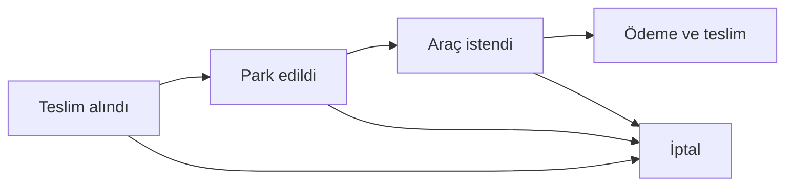
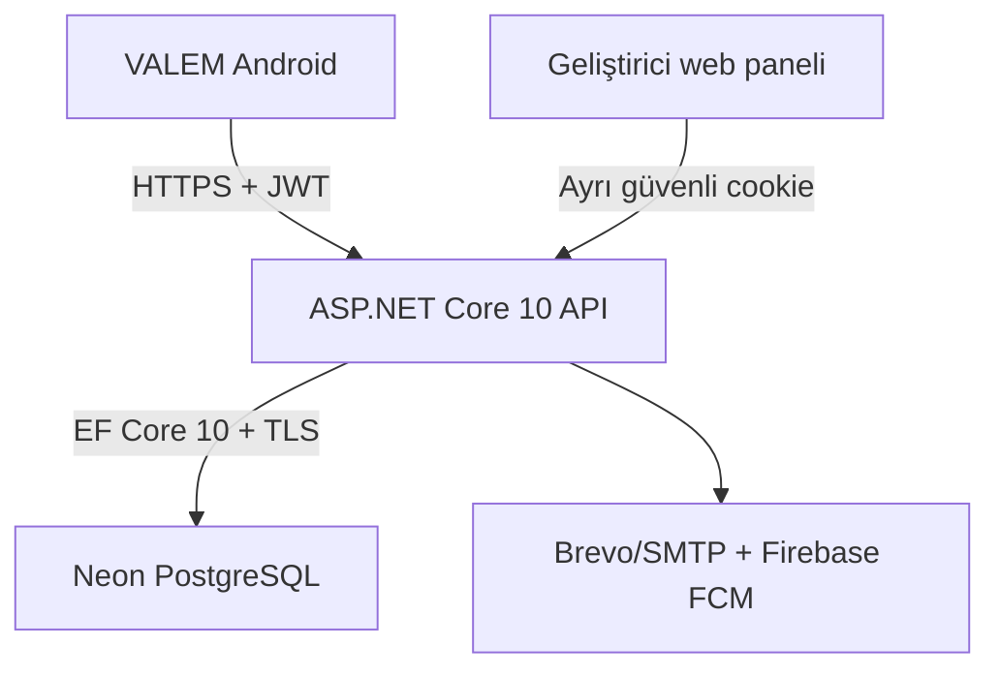

# VALEM

VALEM, vale işletmelerinin araç kabulünden teslim ve tahsilata kadar günlük operasyonunu telefondan yönetmesini sağlayan çok firmalı bir platformdur. Güncel ürün; .NET MAUI Android uygulaması, ASP.NET Core API, PostgreSQL veritabanı ve yalnızca geliştiriciye açık web yönetim panelinden oluşur.

Güncel sürüm: **3.3.1** (`Android build 16`)

Canlı API: [vale-api-5fvb.onrender.com](https://vale-api-5fvb.onrender.com/api/status)

## Bu sürümde neler var?

- Plaka dışında ayrıntı zorunlu tutmayan hızlı araç kabulü
- Firma sahibi için ad, e-posta ve firma adıyla başlayan sade kayıt
- Personel deneme hesabı için davet/bağlantı kodu istemeyen, benzersiz firma ve Merkez şubesi oluşturan açık kayıt
- Personel için tek davet koduyla katılım; firma/şube kodu yalnızca alternatif yol
- Varsayılan parolasız e-posta kodu, isteğe bağlı parola veya Authenticator girişi
- Authenticator etkin hesaplarda parola istemeyen e-posta + 6 haneli TOTP girişi; deneme sınırı ve hesap kilitleme koruması
- Güvenli cihazı hatırlama; 30 günlük dönen ve sunucuda yalnızca özeti saklanan oturum anahtarı
- Firma ve şube sınırlarını API ile zorlayan çok kiracılı yetkilendirme
- Araç durumu, teslim isteği, tahsilat, rapor, bildirim, FCM ve denetim kaydı
- Geliştirici için ayrı kimlik doğrulamalı VALEM web yönetim paneli
- `EnsureCreated` yerine sürümlü EF Core migration ve eski 3.1.2 şemasını güvenli devralma
- .NET MAUI 10.0.100, uyumlu AndroidX bağımlılıkları ve Firebase Messaging 125.1.1
- AndroidX geri hareketi, Firebase FID kaydı ve güvenli Google service-account yükleme API’leri
- Gerçek üst-seviye sayfa geçmişini izleyen Android geri hareketi; çıkış uyarısı yalnızca Ana Sayfa’da gidilecek yer kalmadığında görünür
- Kamera/galeri profil fotoğrafı ve oturum çekmecesinde kullanıcı avatarı
- Tüm sayfaya yayılan Mavi, İndigo, Zümrüt ve Turuncu renkleri; iki Anime, iki Araba ve galeriden özel arka plan
- Özel görselin baskın rengini/luminansını örnekleyerek vurgu, kart saydamlığı ve yazı kontrastını otomatik uyarlama
- API için 66 otomatik test; gerçek Android cihazı için Appium/UiAutomator2 senaryosu

## Kullanıcı açısından akış

### Firma sahibi

1. `Yeni Hesap Oluştur` seçilir.
2. Ad soyad, e-posta ve firma adı yazılır.
3. Firma kodu ile `Merkez` şubesi otomatik üretilir; özel kodlar gelişmiş bölümde isteğe bağlıdır.
4. E-posta sahipliği doğrulanır.
5. Seçilen tek giriş yöntemiyle uygulamaya girilir.

### Personel

1. `Personel / deneme hesabı` seçilir; ad soyad, e-posta ve istenen firma adı yazılır.
2. Sistem aynı firma adı daha önce kullanılmış olsa bile hesaba özel, benzersiz firma ve Merkez şubesi kodları üretir.
3. Yönetici onayı, davet kodu veya bağlantı kodu beklenmeden hesap etkinleşir.
4. Varsayılan parolasız e-posta kodu veya kullanıcının seçtiği giriş yöntemiyle hemen devam edilir.

### Günlük vale işlemi

Yeni araç kabulünde yalnızca plaka zorunludur. Marka, model, renk, müşteri, anahtar etiketi, park yeri, not ve ücret gibi alanlar gerektiğinde açılan ayrıntı bölümündedir. Durum akışı şöyledir:



## Mimari



Telefon ve web paneli veritabanına doğrudan bağlanmaz. Bağlantı dizesi, JWT anahtarı, e-posta parolası ve Firebase service-account yalnızca API ortamında tutulur.

PostgreSQL/Neon korunmuştur. Mevcut ilişkisel veri, tenant sınırları, ödeme tutarlılığı ve rapor sorguları için en kompakt ve düşük riskli seçenek budur; başka bir veritabanına geçiş uygulamayı hızlandırmak yerine veri taşıma ve yetkilendirme riskini büyütecekti. Asıl eksik olan şema sürümlemesiydi ve 3.2.0 ile EF Core migration’a geçirildi.

## Proje yapısı

| Yol | İçerik |
| --- | --- |
| `src/VALE.Mobile` | .NET MAUI Android uygulaması |
| `src/VALE.Api` | ASP.NET Core API ve Razor tabanlı geliştirici paneli |
| `src/VALE.Contracts` | Mobil/API ortak sözleşmeleri |
| `src/VALE.Client` | Korunan eski WinUI istemcisi; aktif geliştirme hedefi değil |
| `tests/VALE.Api.Tests` | İş kuralı, tenant/BOLA ve güvenli oturum testleri |
| `tests/VALE.Mobile.UITests` | Appium ile fiziksel Android cihaz senaryosu |
| `scripts` | Kurulum, doğrulama ve gerçek cihaz test betikleri |
| `.github/workflows` | API, APK, production smoke ve fiziksel cihaz iş akışları |

## Gereksinimler

- .NET 10 SDK
- Android derlemek için Java 17, Android SDK ve `maui-android` workload
- Yerel API için PostgreSQL 17 veya Neon bağlantısı
- İsteğe bağlı Docker Desktop (`docker-compose.dev.yml` için)
- Fiziksel cihaz testi için Node.js, Appium, UiAutomator2, `adb` ve USB hata ayıklaması açık bir Android telefon

## Yerel kurulum

### 1. PostgreSQL’i başlatın

Docker kullanıyorsanız:

```powershell
docker compose -f .\docker-compose.dev.yml up -d
```

Yerel örnek bağlantı dizesi:

```text
Host=localhost;Port=5432;Database=vale;Username=vale;Password=vale-dev-only
```

Bu parola yalnızca yerel geliştirme içindir.

### 2. API sırlarını kaydedin

Windows PowerShell’de:

```powershell
Set-ExecutionPolicy -Scope Process Bypass
.\scripts\configure-api.ps1
```

Betik değerleri repoya değil .NET User Secrets alanına yazar. İki farklı yönetici hesabı ister:

- `PlatformAdmin`: geliştiricinin web paneli hesabı; herhangi bir firmaya bağlı değildir.
- `Seed Admin`: örnek/ilk firmanın mobil operasyon yöneticisidir.

### 3. API’yi çalıştırın

```powershell
.\scripts\run-api.ps1
```

Geliştirme adresi `https://localhost:7247/` olur. Kontrol yolları:

- `GET /health/ready`: API ve veritabanı hazır mı?
- `GET /health/email`: e-posta taşıyıcısı kimlik doğrulaması hazır mı?
- `GET /api/status`: sürüm ve etkin yetenekler
- Geliştirmede `GET /openapi/v1.json`: OpenAPI belgesi

### 4. Android uygulamasını derleyin

```powershell
dotnet workload install maui-android
dotnet restore .\src\VALE.Mobile\VALE.Mobile.csproj
dotnet build .\src\VALE.Mobile\VALE.Mobile.csproj -f net10.0-android -c Release -warnaserror
```

APK üretmek için:

```powershell
dotnet publish .\src\VALE.Mobile\VALE.Mobile.csproj -f net10.0-android -c Release `
  -p:AndroidPackageFormats=apk -p:RunAOTCompilation=false
```

Firebase bildirimi kullanılacaksa `src/VALE.Mobile/Platforms/Android/google-services.json` dosyasını yerel olarak ekleyin. Dosya `.gitignore` kapsamındadır ve kesinlikle commit edilmez. Dosya yokken uygulamanın geri kalanı çalışır, FCM devre dışı kalır.

Uygulama varsayılan olarak canlı Render API’sine bağlanır. Yerel/özel HTTPS API için giriş ekranındaki `Bağlantı ayarları` kullanılabilir.

## Geliştirici web yönetim paneli

Adres:

```text
https://SUNUCU/platform-admin/Account/Login
```

Hesap `PlatformAdmin__Email`, `PlatformAdmin__Password` ve `PlatformAdmin__FullName` ile ilk çalıştırmada oluşturulur. Platform hesabı bir firma kullanıcısıyla aynı e-postayı kullanamaz.

Panelden şunlar yapılabilir:

- Tüm firma, şube, kullanıcı ve personel başvurularını arama
- Firma/şube durumunu ve temel bilgilerini düzenleme
- Ana firma sahipliğini aynı firmadaki aktif bir kullanıcıya güvenli biçimde devretme
- Şube davet kodunu yenileme
- Kullanıcı rollerini ve aktif durumunu düzenleme
- Kullanıcının hatırlanan cihaz oturumlarını kapatma
- Kullanıcının Authenticator ayarını destek amacıyla sıfırlama
- Kullanıcıya uygulama içi destek bildirimi gönderme
- Vale kayıtlarını inceleme, düzeltme, kontrollü silme ve geri alma
- Platform denetim günlüğünü inceleme
- Uygulanan/bekleyen migration, veritabanı, e-posta, Firebase ve aktif oturum durumunu görme

Panel bilinçli olarak serbest SQL çalıştırmaz ve sırları göstermez. Ayrı `PlatformAdmin` rolü, iki saatlik ayrı cookie oturumu, güvenlik damgası kontrolü, giriş hız sınırı, CSRF koruması ve işlem denetim kaydı kullanır.

## Veritabanı migration sistemi

API her başlangıçta PostgreSQL advisory lock alır ve bekleyen migration’ları uygular. Böylece aynı anda birden fazla instance açılırse şema yarışı oluşmaz.

Eski 3.1.2 veritabanında migration geçmişi yoksa sistem önce beklenen tabloları ve kritik kolonları doğrular. Şema eksik veya belirsizse veri kaybı riski almadan başlangıcı durdurur; doğrulama geçerse başlangıç migration’ını geçmişe işler ve yalnızca yeni 3.2 migration’larını uygular.

Yeni model değişikliği ekleme:

```powershell
dotnet tool install --global dotnet-ef --version 10.0.4
dotnet ef migrations add AciklayiciMigrationAdi `
  --project .\src\VALE.Api\VALE.Api.csproj `
  --startup-project .\src\VALE.Api\VALE.Api.csproj
dotnet ef migrations has-pending-model-changes `
  --project .\src\VALE.Api\VALE.Api.csproj `
  --startup-project .\src\VALE.Api\VALE.Api.csproj
```

CI ayrıca idempotent PostgreSQL migration betiği üretir. Migration dosyaları uygulama modeliyle birlikte commit edilmelidir; production’da `EnsureCreated` veya elle `ALTER TABLE` kullanılmaz.

## Testler

### API ve Android kaynak doğrulaması

```powershell
.\scripts\verify.ps1
```

Bu komut API’yi uyarıları hata sayarak derler, 64 API testini çalıştırır, Appium test paketini derler, Android Release build alır ve `dotnet-ef` kuruluysa bekleyen model farkını kontrol eder.

### Fiziksel Android cihaz testi

Bir kez hazırlayın:

```powershell
npm install --global appium
appium driver install uiautomator2
adb devices
```

Telefon USB ile bağlı, kilidi açık ve `adb devices` çıktısında `device` durumunda olmalıdır. Sonra ürettiğiniz Release APK ile:

```powershell
.\scripts\run-android-device-tests.ps1 -ApkPath "C:\tam\yol\VALE.apk"
```

Senaryo gerçek ekranda şunları doğrular:

- Giriş alanları ve düğmelerinin kullanılabilir olması
- `Bu güvenli cihazda oturumu açık tut` anahtarının çalışması
- Alternatif e-posta kodu girişinin açılması
- Authenticator ekranında yalnızca e-posta ve 6 haneli kod bulunması; parola alanının olmaması
- Kayıt ekranında yalnızca temel alanların görünmesi
- Parola ve gelişmiş firma alanlarının varsayılan olarak kapalı olması
- Android sistem geri hareketinin kayıt ekranından giriş ekranına dönmesi
- Başarı veya hata ekran görüntüsü ile `.trx` test kanıtı

GitHub’daki `Android Real Device UI` workflow’u, `vale-android-device` etiketli Windows self-hosted runner ve bağlı telefon üzerinde aynı betiği elle çalıştırır. Bulut runner’ında telefon olmadığı için bu iş akışı otomatik release kapısına bağlanmamıştır.

## CI/CD ve yayın

| İş akışı | Ne yapar? |
| --- | --- |
| `VALE API CI` | Release build, 66 test, bağımlılık/secret kontrolü, migration model+SQL doğrulaması ve güvenlik kaynak kapıları |
| `Build Android APK` | AndroidX/Firebase kontrolleri, production API/e-posta smoke testleri, Appium paket derlemesi, APK üretimi ve GitHub Release |
| `Verify Production VALE API` | Render deploy sonrası 3.3.1, veritabanı, e-posta, auth ve web paneli erişim sınırlarını doğrular |
| `Android Real Device UI` | Bağlı fiziksel telefonda Appium senaryosunu elle çalıştırır |

`main` dalındaki başarılı Android workflow’u `VALE.apk` dosyasını yeni GitHub Release’e ekler. Play Store için kalıcı imza depoya yazılmaz: workflow yalnızca `VALE_ANDROID_KEYSTORE_B64`, `VALE_ANDROID_STORE_PASSWORD`, `VALE_ANDROID_KEY_ALIAS` ve `VALE_ANDROID_KEY_PASSWORD` GitHub Actions secretlarıyla imza üretir. Anahtarın çevrimdışı kurtarma kopyası güvenli ve yedekli tutulmalıdır; kaybolursa aynı uygulama kimliğiyle güncelleme yayınlamak mümkün olmayabilir.

Kalıcı Play upload anahtarını Windows bilgisayarında oluşturup secretları yüklemek için:

```powershell
.\scripts\create-android-play-keystore.ps1 -OutputDirectory "D:\VALEM-GUVENLI-YEDEK" -UploadGitHubSecrets
```

Betik parolaları güvenli girişle sorar, hiçbir parolayı repoya/düz metin dosyasına yazmaz ve mevcut `.jks` dosyasının üzerine çıkmaz. Oluşan `VALEM-upload-key.jks` dosyasını ve parolaları iki ayrı güvenli çevrimdışı konumda yedekleyin.

## Üretim ortam değişkenleri

| Değişken | Zorunluluk | Açıklama |
| --- | --- | --- |
| `ConnectionStrings__ValeDatabase` | Zorunlu | Neon pooled PostgreSQL bağlantısı |
| `Jwt__Key` | Zorunlu | En az 32 bayt rastgele JWT anahtarı |
| `PlatformAdmin__Email` | Panel için | Geliştirici hesabı e-postası |
| `PlatformAdmin__Password` | İlk oluşturma için | Güçlü geliştirici hesabı parolası |
| `PlatformAdmin__FullName` | İsteğe bağlı | Panelde görünen ad |
| `Seed__AdminEmail`, `Seed__AdminPassword` | İlk firma için | Mobil firma yöneticisi başlangıç hesabı |
| `Email__*` | E-posta için | Brevo API veya SMTP yapılandırması |
| `Firebase__ProjectId` | FCM için | Firebase proje kimliği |
| `Firebase__ServiceAccountJson` | FCM için | Service-account JSON; dosya olarak commit edilmez |
| `DeviceSessions__LifetimeDays` | İsteğe bağlı | Varsayılan `30` |

Render Blueprint ayrıntıları `render.yaml` dosyasındadır. Canlı sağlık kontrolü `/health/ready` yolunu kullanır. Render ücretsiz servis uykuya geçtiğinde ilk istek gecikebilir; mobil giriş ve izleme akışı kısa tekrarlarla bunu karşılar.

## Güvenlik özeti

- API, firma kimliğini istemciden kabul etmez; JWT ve sunucu tarafı ilişkiler üzerinden çözer.
- Yabancı tenant nesneleri kimlik sızıntısını azaltmak için bulunamadı gibi yanıtlanır; BOLA negatif testleri bunu doğrular.
- Hatırlanan cihaz anahtarı telefonda `SecureStorage` içinde, sunucuda SHA-256 özetiyle tutulur ve her yenilemede döndürülür.
- Parola, JWT anahtarı, veritabanı parolası, Firebase service-account ve `google-services.json` repoya yazılmaz.
- Hassas web paneli işlemleri rol, ayrı cookie, CSRF ve denetim günlüğüyle korunur.
- Firebase’in kaldırılacak `getToken`/`onNewToken` ve sunucudaki eski `Message.Token` yolu yeni cihazlarda FID akışına geçirilmiştir; yalnızca eski 3.1.x kayıtları geçiş süresince uyumluluk yolunda tutulur.
- Android’in eski geri tuşu override’ı yerine AndroidX `OnBackPressedDispatcher` kullanılır.
- Google service-account JSON’u önce tür/proje kontrolünden geçirilir ve `CredentialFactory` ile yüklenir; güvenlik nedeniyle kaldırılacak `GoogleCredential.FromJson` kullanılmaz.

## Bilinçli olarak sonraya bırakılanlar

- Play Store için kalıcı özel keystore, uygulamadaki geliştirmeler tamamlandığında oluşturulacak.
- WinUI/Windows masaüstü yayını şu an ürün hedefi değildir; eski proje yalnızca geçmiş çalışma kaybı olmaması için repoda tutulur.
- Gerçek cihaz testi bu depoda hazırdır; belirli telefon/Android sürümüne ait sonuç, cihazın bağlı olduğu Windows makinede çalıştırıldığında oluşur.
